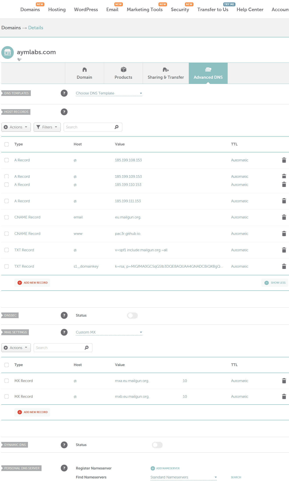

# Aym Website

This site is hosted as a Github page. See [here](https://docs.github.com/en/pages/configuring-a-custom-domain-for-your-github-pages-site/managing-a-custom-domain-for-your-github-pages-site) for how this works.

The DNS is provided by Namecheap. The domain name is aymlabs.com (apex, no subdomain). 

Here is how to set up Namecheap for a Github page (see the original outdated post [here](https://www.namecheap.com/support/knowledgebase/article.aspx/9645/2208/how-do-i-link-my-domain-to-github-pages/)):
1. Add four A records with @ pointing to: 185.199.110.153, 185.199.108.153, 185.199.109.153, and 185.199.111.153
2. Add a CNAME record pointing www to pac3r.github.io (this ensures the redirection from the www sub domain, even with https, see [here](https://docs.github.com/en/pages/configuring-a-custom-domain-for-your-github-pages-site/managing-a-custom-domain-for-your-github-pages-site#configuring-an-apex-domain-and-the-www-subdomain-variant)).
3. Wait for the DNS servers to update (can take 24 hours or a few minutes).
4. Add your domain (without the www.) to the settings section or your github pages repo.
5. You may get a few errors, but after a few minutes it will be possible to check the force HTTPS box, and a few more minutes https://yourdomain will start working.

